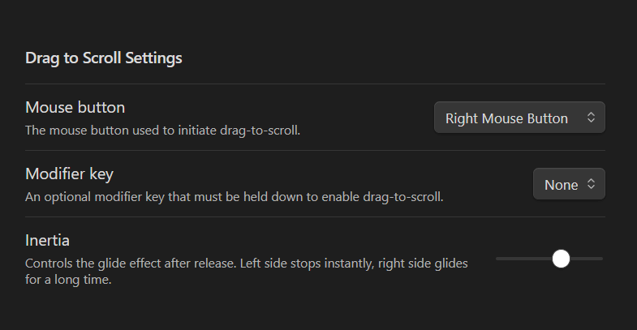

# Drag To Scroll
Adds drag-to-scroll functionality to Obsidian. Hold mouse button and drag - now you can scroll like on touch device!

Works in both Edit and Reading modes. Inspired by PDF viewers and similar browser extensions.

Only for Desktop (on mobile this is a basic functionality).

  

---

 

### Plugin Menu:

### Demonstration:
